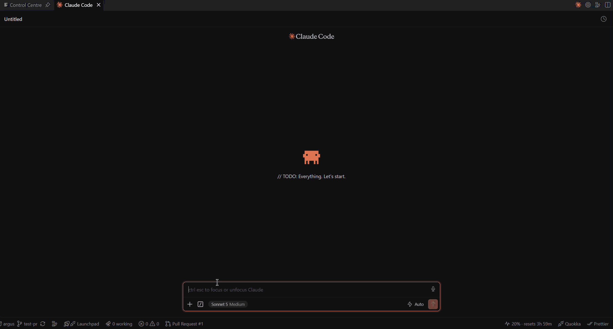

# Argus

Mission control for [Claude Code](https://claude.com/claude-code) in VS Code. See every Claude Code session at a
glance, and know which ones are waiting on you.



## Features

### Sessions board

A sidebar view (Argus icon in the activity bar) groups your Claude Code sessions into **Needs you**, **Working**,
**PR open**, **Idle** and **Archived**. Cards move on their own as session state changes.

- A session stopped mid-turn (Esc, a crash or a closed tab) shows as **interrupted** in **Needs you**, so you know
  to resume it. Sessions closed mid-turn are only caught after re-running **Argus: Set Up Session Tracking**.

- Each VS Code window shows only its own sessions: those started in the window's workspace folders, or in any
  checkout or worktree of the same git repo. Set `argus.sessions.scope` to `all` to see every session in every
  window. A window with no folder open shows everything.
- The activity bar badge counts sessions that need you.
- A status bar item shows how many sessions need you and the longest wait. Click it to pick one and jump to its
  tab.
- Open a session tab from a card. Argus asks the Claude Code extension to reveal the existing tab or resume the
  session.
- Sessions archive themselves when every PR they created is merged or closed, or when a closed session made no
  PR. Archiving can also run cleanup offered by an installed plugin (you are asked first).
- A card's title is the session's first prompt until you name it with Claude Code's `/rename`, which also sets
  the name other sessions use to message it. Search with `/`, move with `j`/`k`, open with `Enter`, archive with
  `e`, new chat with `n`.
- Notifications appear in VS Code when a session starts waiting on you: a warning when it needs permission or
  asks a question, info when finished. The **Open Session** button jumps straight to the session tab. Disable with
  `argus.notifications` set to `input` (permission and questions only) or `off`.

### Control Centre

Run **Argus: Open Control Centre** for the full view. Out of the box it holds the Sessions tab; installing a
plugin adds its tab alongside it. The Sessions tab adds to the sidebar:

- Columns side by side. Press `g` (or **by repo**) to split them into one row per repo, with repos that need
  you first.
- Token use on each card: `ctx` is the size of the latest prompt (how full the context is), `used` is new input,
  cache writes and output summed over the session and its sub-agents, and how many times it was compacted. Read
  from the session transcript in `~/.claude/projects`, only the lines added since the last read.
- Search also looks through every prompt and reply in each session's transcript, archived sessions included, and
  shows the matching text on the card. It starts at three characters.
- Sub-agents running in a session, by type. Needs **Argus: Set Up Session Tracking** re-run once to add the
  SubagentStart and SubagentStop hooks.

### Claude plan usage

A status bar item showing your Claude plan usage as a percentage (amber at 75%, red at 90%). It is on by default;
turn it off with `argus.usage.enabled`. It reads the Claude Code sign-in that Claude Code stores locally
(`~/.claude/.credentials.json`, or the macOS keychain) and sends it only to Anthropic's undocumented usage
endpoint (`https://api.anthropic.com/api/oauth/usage`). The token is not stored, cached or logged. Usage updates
every `argus.usage.refreshMinutes` (default 5). Check Anthropic's terms on using your Claude subscription sign-in
with third-party tools.

## Plugins

A plugin adds a tab to the Control Centre, chips to session cards, or extra steps when a session is archived.
Plugins are folders in `~/.claude/argus/plugins`, loaded by Argus on startup — nothing is installed into
VS Code.

### Installing one

Clone it into the plugins folder and build it:

```bash
mkdir -p ~/.claude/argus/plugins && cd ~/.claude/argus/plugins

# Work board: a kanban of tickets, with PR state and linked Claude Code sessions.
git clone https://github.com/Import-Star/argus-kanban.git kanban

# GitHub Actions: workflow runs, approvals and per-app status.
git clone https://github.com/Import-Star/argus-actions.git actions

# PR Reviews: picks up review requests from Slack and runs Claude Code reviews.
git clone https://github.com/Import-Star/argus-pr-reviews.git pr-reviews

for p in kanban actions pr-reviews; do (cd $p && npm install && npm run build); done
```

Then run **Argus: Reload Plugins**. Argus asks once per folder before it loads a plugin for the first time,
because a plugin runs with the same access to your machine that Argus has.

Update one the same way: `git pull && npm install && npm run build`, then **Argus: Reload Plugins**.

Useful commands: **Argus: Reload Plugins**, **Argus: Open Plugins Folder**, **Argus: Run Plugin Command**,
**Argus: Reset Plugin Trust**.

### Configuring one

Plugin settings live under one key, keyed by plugin id, and work at user or workspace level:

```json
"argus.plugins.config": {
  "kanban": { "boardFile": "active-work.json" },
  "actions": { "repo": "owner/name" }
}
```

Each plugin's README lists its keys. `argus.plugins.paths` loads extra plugin folders from anywhere on disk,
which is how you run one straight from a checkout.

### Writing one

See [DEVELOPING.md](DEVELOPING.md#writing-a-plugin) for the API, the manifest and a worked example.

## Requirements

- VS Code 1.90 or newer.
- The [Claude Code extension](https://marketplace.visualstudio.com/items?itemName=anthropic.claude-code), which
  Argus uses to open sessions. Argus relies on its `claude-vscode.editor.open` command and the session registry
  it keeps at `~/.claude/sessions/<pid>.json`; neither is a documented public API and both may change.
- [Node.js](https://nodejs.org) 24 or newer on your `PATH`. The session tracker hook is a TypeScript file that
  Node runs natively.
- Optional: `git`, for worktree detection.

## Getting started

1. Install Argus.
2. Run **Argus: Set Up Session Tracking** from the command palette (or click the link in the empty Sessions
   view). This installs the hooks; it's required for sessions to appear.
3. Start or resume a Claude Code session. It appears in the sidebar after its first prompt. Sessions that were
   already open show up once they next fire a hook.

## What Argus reads and writes

Argus is local-only. It has no telemetry.

| Path | Purpose |
| --- | --- |
| `~/.claude/settings.json` | "Set Up Session Tracking" adds hook entries; "Remove Session Tracking" removes them. A `.bak` copy is written first. |
| `~/.claude/argus/session-tracker.ts` | The hook script, copied out of the extension so updates never break the path in settings. |
| `~/.claude/argus/plugins/` | Plugin folders, loaded on startup. Argus also writes `argus.d.ts` and `argus-webview.d.ts` here for plugin authors. |
| `~/.claude/argus/sessions/<id>.json` | One record per session, written by the hook on SessionStart, UserPromptSubmit, PreToolUse, PostToolUse, PermissionRequest, Notification, Stop, SubagentStart, SubagentStop and SessionEnd. It holds prompt snippets, the last assistant message and any pending tool command in plain text. Deleted `argus.sessions.retentionDays` days after the session closes. |
| `~/.claude/sessions/<pid>.json` | Claude Code's own registry of open sessions (read only). |
| `~/.claude/projects/**/*.jsonl` | Claude Code's session transcripts and sub-agent transcripts (read only), for token use and search. Kept in memory, never written anywhere. |
| `~/.claude/.credentials.json` | Claude Code sign-in (read only, while `argus.usage.enabled` is on, which is the default). Sent only to the Anthropic usage endpoint. |

Network use: `gh` calls to GitHub for PR state, using your existing `gh` login (`argus.prs.cacheSeconds`).
A plugin may make its own network calls; see its own README.

## Settings

| Setting | Default | Description |
| --- | --- | --- |
| `argus.sessions.scope` | `window` | `window` shows this window's sessions only; `all` shows every session on this machine. |
| `argus.sessions.staleAfterHours` | `24` | Closed sessions with no open PR are archived after this many hours without activity. |
| `argus.sessions.prRefreshMinutes` | `5` | How often PR states refresh in the background, for session cards. |
| `argus.sessions.retentionDays` | `30` | Session record files are deleted this many days after the session is no longer open. |
| `argus.notifications` | `all` | Show notifications when a session needs attention: `all` (permission, question or finished), `input` (permission and questions only), or `off`. |
| `argus.prs.cacheSeconds` | `300` | How long a fetched PR state is reused before `gh` is called again. |
| `argus.usage.enabled` | `true` | Show Claude plan usage in the status bar. Turn off to stop reading the Claude Code sign-in. |
| `argus.usage.refreshMinutes` | `5` | How often Claude plan usage refreshes in the background. |
| `argus.plugins.config` | `{}` | Settings for locally installed plugins, keyed by plugin id. See [Plugins](#plugins). |
| `argus.plugins.paths` | `[]` | Extra plugin folders to load, on top of everything in `~/.claude/argus/plugins`. |

## Commands

- **Argus: Open Control Centre** (`argus.openControlCentre`)
- **Argus: Sessions Needing You** (`argus.sessions.showAttention`)
- **Argus: Set Up Session Tracking** (`argus.sessions.installHooks`)
- **Argus: Remove Session Tracking** (`argus.sessions.removeHooks`)
- **Argus: Show Claude Plan Usage** (`argus.usage.show`)
- **Argus: Refresh Claude Plan Usage** (`argus.usage.refresh`)

The Sessions view also has per-item and toolbar commands (refresh, open, mark read, archive/unarchive,
open worktree, new chat) available from its icons and context menu.

## Troubleshooting

- **No sessions appear**: run **Argus: Set Up Session Tracking**, confirm `node --version` is 24 or newer in a
  terminal, then start a new Claude Code session.
- **Sessions stop updating after a Claude Code or VS Code update**: Argus depends on `claude-vscode.editor.open`
  and Claude Code's session registry file, neither of which is a stable public API. If either changes shape,
  reveal/open and session detection can break until Argus is updated.
- **PR status fails**: run `gh auth status`. If `gh` is installed but not found, make sure it is on the PATH VS
  Code was launched with.

## Uninstalling

Uninstalling the extension automatically removes the hook entries from `~/.claude/settings.json` (the same as
running **Argus: Remove Session Tracking** first). It keeps your
session records under `~/.claude/argus/sessions`.

## License

MIT.
